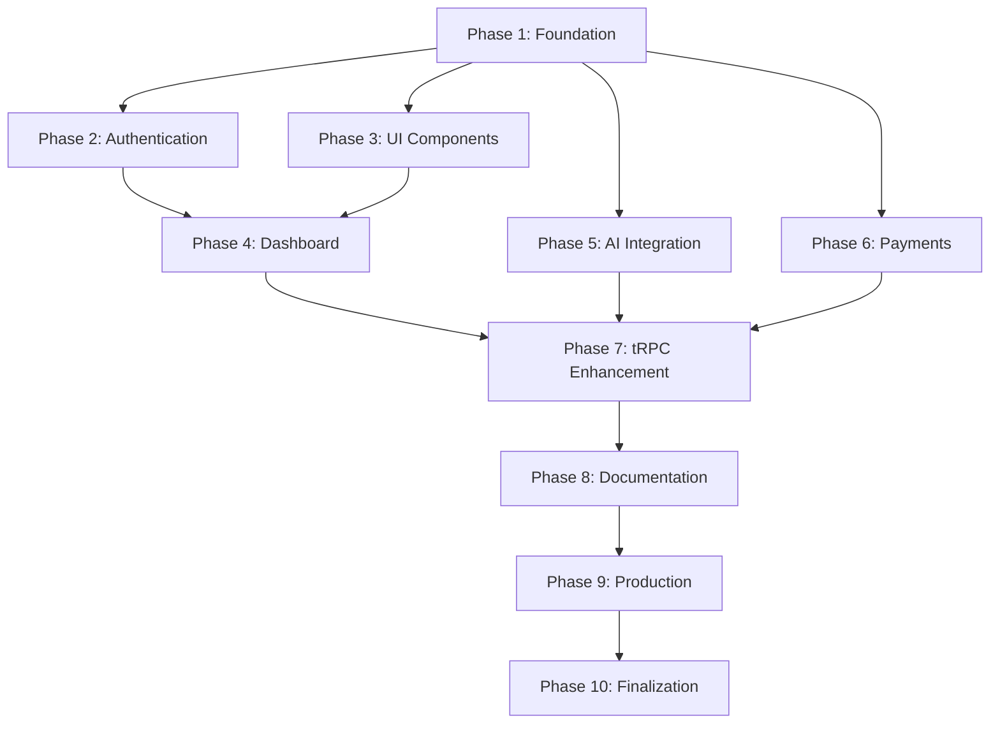

# TweetWriter Boilerplate - Development Phases

## 🎯 Overview

This document breaks down the PRD into manageable development phases, ensuring systematic implementation of all features while maintaining code quality and functionality at each step.

---

## 📋 Phase 1: Foundation & Core Setup

**Duration**: 1-2 days  
**Goal**: Establish solid foundation with essential tooling

### 1.1 Project Structure & Dependencies

- [ ] Clean up existing boilerplate structure
- [ ] Install and configure ESLint + Prettier
- [ ] Set up TypeScript strict mode
- [ ] Configure Git hooks (pre-commit)
- [ ] Create comprehensive `.env.example`
- [ ] Update `package.json` with all required dependencies

### 1.2 Database Integration

- [ ] Install Prisma CLI and client
- [ ] Configure Neon.tech database connection
- [ ] Create initial Prisma schema
  - [ ] User model (Google profile data)
  - [ ] Session model (Better Auth)
  - [ ] Account model (OAuth providers)
- [ ] Set up database migrations
- [ ] Test database connection

### 1.3 Environment Configuration

- [ ] Create `.env.local` template
- [ ] Document all required environment variables
- [ ] Set up environment validation with Zod
- [ ] Configure different environments (dev/staging/prod)

**Deliverables:**

- ✅ Clean project structure
- ✅ Database connected and schema ready
- ✅ Environment configuration complete
- ✅ Development tools configured

---

## 🔐 Phase 2: Authentication System

**Duration**: 2-3 days  
**Goal**: Implement secure Google OAuth authentication

### 2.1 Better Auth Setup

- [ ] Install Better Auth dependencies
- [ ] Configure Better Auth with Google provider
- [ ] Set up authentication routes (`/api/auth/*`)
- [ ] Configure session management
- [ ] Set up CSRF protection

### 2.2 Google OAuth Configuration

- [ ] Create Google Cloud Console project
- [ ] Configure OAuth consent screen
- [ ] Generate client ID and secret
- [ ] Set up authorized redirect URIs
- [ ] Test OAuth flow

### 2.3 Authentication Middleware

- [ ] Create authentication middleware
- [ ] Implement route protection
- [ ] Set up session validation
- [ ] Create auth utilities and hooks
- [ ] Handle authentication errors

### 2.4 User Management

- [ ] Create user registration flow
- [ ] Implement user profile management
- [ ] Set up user session persistence
- [ ] Create logout functionality
- [ ] Test complete auth flow

**Deliverables:**

- ✅ Google OAuth working
- ✅ Protected routes implemented
- ✅ User session management
- ✅ Authentication middleware

---

## 🎨 Phase 3: UI Foundation & Components

**Duration**: 2-3 days  
**Goal**: Set up complete UI system with shadcn/ui

### 3.1 shadcn/ui Installation

- [ ] Initialize shadcn/ui in project
- [ ] Install ALL available components:
  - [ ] Accordion, Alert, Alert Dialog
  - [ ] Avatar, Badge, Button
  - [ ] Calendar, Card, Carousel
  - [ ] Checkbox, Collapsible, Command
  - [ ] Context Menu, Data Table, Date Picker
  - [ ] Dialog, Drawer, Dropdown Menu
  - [ ] Form, Hover Card, Input
  - [ ] Label, Menubar, Navigation Menu
  - [ ] Pagination, Popover, Progress
  - [ ] Radio Group, Scroll Area, Select
  - [ ] Separator, Sheet, Skeleton
  - [ ] Slider, Switch, Table
  - [ ] Tabs, Textarea, Toast
  - [ ] Toggle, Tooltip, Typography

### 3.2 Theme Configuration

- [ ] Set up CSS variables for theming
- [ ] Configure light/dark mode
- [ ] Create theme provider
- [ ] Set up theme toggle component
- [ ] Test theme switching

### 3.3 Layout Components

- [ ] Create main layout wrapper
- [ ] Build responsive sidebar component
- [ ] Create header with user info
- [ ] Implement breadcrumb navigation
- [ ] Add loading states and skeletons

### 3.4 Component Documentation

- [ ] Create component showcase page
- [ ] Document usage examples
- [ ] Set up Storybook (optional)
- [ ] Test responsive behavior

**Deliverables:**

- ✅ Complete shadcn/ui component library
- ✅ Theme system with light/dark mode
- ✅ Responsive layout components
- ✅ Component documentation

---

## 🏠 Phase 4: Dashboard Implementation

**Duration**: 1-2 days  
**Goal**: Create functional dashboard with sidebar navigation

### 4.1 Dashboard Layout

- [ ] Create dashboard page structure
- [ ] Implement sidebar navigation
- [ ] Add collapsible sidebar functionality
- [ ] Create main content area
- [ ] Set up responsive behavior

### 4.2 Navigation System

- [ ] Define navigation menu items:
  - [ ] Dashboard (Home)
  - [ ] Profile
  - [ ] Billing
  - [ ] Settings
  - [ ] Logout
- [ ] Implement active state indicators
- [ ] Add navigation icons
- [ ] Create mobile navigation

### 4.3 Dashboard Pages

- [ ] Create dashboard home page
- [ ] Build user profile page
- [ ] Create settings page
- [ ] Add placeholder billing page
- [ ] Implement logout functionality

### 4.4 Route Protection

- [ ] Protect all dashboard routes
- [ ] Redirect unauthenticated users
- [ ] Handle authentication state changes
- [ ] Test route protection

**Deliverables:**

- ✅ Functional dashboard with sidebar
- ✅ Protected dashboard routes
- ✅ Responsive navigation
- ✅ Basic dashboard pages

---

## 🤖 Phase 5: AI Integration

**Duration**: 1-2 days  
**Goal**: Integrate Vercel AI SDK with multiple providers

### 5.1 Vercel AI SDK Setup

- [ ] Install Vercel AI SDK
- [ ] Configure OpenAI provider
- [ ] Configure Anthropic provider
- [ ] Set up streaming responses
- [ ] Create AI utility functions

### 5.2 AI API Routes

- [ ] Create tRPC AI procedures
- [ ] Implement chat completion endpoint
- [ ] Add streaming support
- [ ] Set up rate limiting
- [ ] Handle AI service errors

### 5.3 AI Components

- [ ] Create chat interface component
- [ ] Build AI response streaming
- [ ] Add loading states
- [ ] Implement error handling
- [ ] Create usage tracking

### 5.4 AI Integration Testing

- [ ] Test OpenAI integration
- [ ] Test Anthropic integration
- [ ] Test streaming responses
- [ ] Test error scenarios
- [ ] Validate rate limiting

**Deliverables:**

- ✅ Vercel AI SDK integrated
- ✅ Multiple AI providers configured
- ✅ Streaming AI responses
- ✅ AI usage tracking

---

## 💳 Phase 6: Payment Integration

**Duration**: 2-3 days  
**Goal**: Implement Polar.sh payment processing

### 6.1 Polar.sh Setup

- [ ] Create Polar.sh account
- [ ] Configure organization
- [ ] Set up products and pricing
- [ ] Generate API keys
- [ ] Configure webhooks

### 6.2 Payment Integration

- [ ] Install Polar.sh SDK
- [ ] Create payment tRPC procedures
- [ ] Implement subscription management
- [ ] Set up customer portal
- [ ] Handle payment webhooks

### 6.3 Billing Dashboard

- [ ] Create billing page
- [ ] Show current subscription
- [ ] Display payment history
- [ ] Add upgrade/downgrade options
- [ ] Implement cancellation flow

### 6.4 Webhook Processing

- [ ] Set up webhook endpoints
- [ ] Validate webhook signatures
- [ ] Process subscription events
- [ ] Update user subscription status
- [ ] Handle failed payments

**Deliverables:**

- ✅ Polar.sh payment processing
- ✅ Subscription management
- ✅ Billing dashboard
- ✅ Webhook handling

---

## 🔧 Phase 7: tRPC API Enhancement

**Duration**: 1-2 days  
**Goal**: Enhance tRPC setup with all necessary procedures

### 7.1 Router Organization

- [ ] Organize routers by feature
- [ ] Create auth router
- [ ] Create user router
- [ ] Create billing router
- [ ] Create AI router

### 7.2 Procedure Implementation

- [ ] User management procedures
- [ ] Authentication procedures
- [ ] Billing procedures
- [ ] AI interaction procedures
- [ ] Settings procedures

### 7.3 Middleware & Context

- [ ] Enhance tRPC context
- [ ] Add authentication middleware
- [ ] Implement rate limiting
- [ ] Add logging middleware
- [ ] Set up error handling

### 7.4 Type Safety

- [ ] Ensure full TypeScript coverage
- [ ] Create shared types
- [ ] Validate all inputs with Zod
- [ ] Test type inference

**Deliverables:**

- ✅ Complete tRPC API structure
- ✅ All necessary procedures
- ✅ Full type safety
- ✅ Proper middleware

---

## 📚 Phase 8: Documentation & Developer Experience

**Duration**: 1-2 days  
**Goal**: Create comprehensive documentation and setup guides

### 8.1 Documentation Creation

- [ ] Update README with setup instructions
- [ ] Create API documentation
- [ ] Document component usage
- [ ] Write deployment guide
- [ ] Create troubleshooting guide

### 8.2 Developer Tools

- [ ] Set up development scripts
- [ ] Create database seeding
- [ ] Add code generation tools
- [ ] Set up testing framework
- [ ] Configure CI/CD pipeline

### 8.3 Quick Start Guide

- [ ] Create step-by-step setup guide
- [ ] Document environment variables
- [ ] Create setup checklist
- [ ] Add common configurations
- [ ] Test setup process

### 8.4 Code Quality

- [ ] Add comprehensive comments
- [ ] Create code examples
- [ ] Set up automated testing
- [ ] Configure code coverage
- [ ] Add performance monitoring

**Deliverables:**

- ✅ Comprehensive documentation
- ✅ Quick start guide (< 15 minutes)
- ✅ Developer tools configured
- ✅ Code quality measures

---

## 🚀 Phase 9: Production Readiness

**Duration**: 1-2 days  
**Goal**: Prepare boilerplate for production deployment

### 9.1 Security Hardening

- [ ] Implement security headers
- [ ] Set up CSRF protection
- [ ] Configure rate limiting
- [ ] Add input sanitization
- [ ] Security audit

### 9.2 Performance Optimization

- [ ] Optimize bundle size
- [ ] Implement code splitting
- [ ] Add performance monitoring
- [ ] Optimize database queries
- [ ] Configure caching

### 9.3 Deployment Configuration

- [ ] Configure Vercel deployment
- [ ] Set up environment variables
- [ ] Configure domain settings
- [ ] Set up monitoring
- [ ] Test production deployment

### 9.4 Final Testing

- [ ] End-to-end testing
- [ ] Performance testing
- [ ] Security testing
- [ ] Mobile responsiveness
- [ ] Cross-browser testing

**Deliverables:**

- ✅ Production-ready application
- ✅ Optimized performance
- ✅ Security hardened
- ✅ Deployment configured

---

## 🎯 Phase 10: Boilerplate Finalization

**Duration**: 1 day  
**Goal**: Finalize boilerplate for reuse

### 10.1 Template Preparation

- [ ] Remove project-specific content
- [ ] Create generic placeholders
- [ ] Update configuration templates
- [ ] Clean up development artifacts
- [ ] Prepare release version

### 10.2 Final Documentation

- [ ] Create boilerplate README
- [ ] Document customization points
- [ ] Create video walkthrough
- [ ] Add FAQ section
- [ ] Create changelog

### 10.3 Quality Assurance

- [ ] Fresh installation test
- [ ] Setup time validation (< 15 minutes)
- [ ] Feature completeness check
- [ ] Documentation accuracy
- [ ] Performance benchmarks

### 10.4 Release Preparation

- [ ] Version tagging
- [ ] Release notes
- [ ] Distribution preparation
- [ ] Backup and archive
- [ ] Success metrics validation

**Deliverables:**

- ✅ Complete boilerplate ready for reuse
- ✅ Setup time < 15 minutes
- ✅ All features working
- ✅ Comprehensive documentation

---

## 📊 Success Criteria

### Technical Metrics

- [ ] TypeScript coverage: 100%
- [ ] Setup time: < 15 minutes
- [ ] Lighthouse score: > 90
- [ ] Zero critical vulnerabilities
- [ ] All tests passing

### Feature Completeness

- [ ] Google OAuth authentication ✅
- [ ] Dashboard with sidebar ✅
- [ ] All shadcn/ui components ✅
- [ ] Neon.tech + Prisma ✅
- [ ] Vercel AI SDK ✅
- [ ] Polar.sh payments ✅
- [ ] Production deployment ✅

### Developer Experience

- [ ] Quick start guide works
- [ ] Environment setup automated
- [ ] Clear documentation
- [ ] Error handling comprehensive
- [ ] Development tools configured

---

## 🔄 Phase Dependencies

## 🎯 Next Steps

1. Review and approve phases
2. Set up development environment
3. Begin Phase 1: Foundation & Core Setup
4. Follow phases sequentially
5. Test thoroughly at each phase
6. Document progress and blockers

**Ready to start Phase 1?** 🚀
